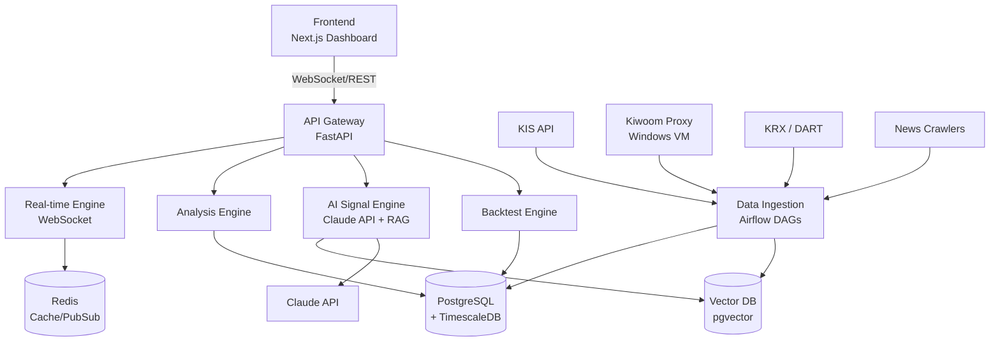

# 주식 매매 자비스 (HANRIVER) 기획서

> 개인 트레이딩 보조용 AI 기반 자비스. RIVERFLOW 매매 일지와 연계하여
> **매매 → 기록 → 복기 → 학습 → 추천 개선**의 닫힌 루프를 구축한다.
>
> 본 문서는 기획 초안이며, Phase 1 MVP 스코프가 확정되면
> 각 Phase 별로 별도 RFC/설계 문서를 분리한다.

---

## 1. 프로젝트 개요

개인 트레이딩을 보조하는 AI 기반 주식 매매 자비스를 구축한다. 국내/해외 시장의
실시간 시황을 한 화면에서 파악하고, 개인화된 AI 모델이 데이 트레이딩과 눌림
스윙 매매 관점에서 종목 및 매수/매도 자리를 제안한다. 기존 RIVERFLOW 매매
일지와 연계하여 매매 → 기록 → 복기 → 학습 → 추천 개선의 닫힌 루프를 만드는
것이 핵심 목표다.

---

## 2. 핵심 가치

- **통합 대시보드**: 여러 HTS와 사이트를 오가지 않고 한 화면에서 시장을 본다
- **개인화 학습**: 내 매매 스타일(데이/눌림스윙)과 과거 매매를 학습한 모델이 추천한다
- **복기 루프**: AI가 매매 결과를 함께 복기하며 나와 함께 성장한다
- **근거 기반**: 모든 추천에는 Claude가 자연어로 쓴 근거 리포트가 따라온다

---

## 3. 사용자 요구사항 기반 주요 기능

### 3.1 실시간 시황 대시보드 (요구사항 1)

- **국내 지수**: 코스피, 코스닥, 코스피200, 코스피 야간 선물
- **해외 지수**: 다우, 나스닥, S&P500, 러셀2000, 니케이, 상해, 홍콩H, 대만 가권
- **환율/원자재**: 원/달러, DXY, WTI, 금, 비트코인, 미국채 10년물 금리
- **시장 심리**: VIX, Fear & Greed Index, MSCI 한국 ETF(EWY), 원/달러 1개월 NDF
- **수급 요약 위젯**: 외국인/기관 누적 순매수, 프로그램 순매수, 공매도 상위
- **시장 히트맵**: 업종별/시총별 등락률 트리맵

### 3.2 뉴스 큐레이션 (요구사항 2)

- **소스 통합**: 한경, 연합인포맥스, 이데일리, 매경, 블룸버그, 로이터
- **DART 공시 실시간 모니터링**
- **LLM 기반 중요도 스코어링**: Claude가 시장 영향도 자동 평가 (상/중/하)
- **자동 entity linking**: 뉴스에서 종목 자동 태깅
- **테마/섹터 트렌드 감지**: 최근 24시간 언급 급증 키워드 추적
- **해외 뉴스 자동 번역 요약** (Claude API)

### 3.3 종목 심층 분석 (요구사항 3)

- **차트**: 일/주/월/분봉, 기술적 지표 (이평선, MACD, RSI, 볼린저, **VSA**)
- **기본 정보**: 시총, 유통 주식 수, 유통 비율, PER/PBR/ROE
- **수급 상세**:
  - 외국인/기관/개인 일별 순매수 및 누적
  - 프로그램 매매 (차익/비차익)
  - 공매도 잔고 및 대차잔고
- **세력주 판단**: 거래량 프로파일, 큰손 매집 흔적 분석 (VSA Sign of Strength)
- **관련 뉴스/공시 타임라인**
- **동종 업계 비교**: PER/PBR/ROE 레이더 차트
- **이벤트 캘린더**: 실적 발표, 배당, 주총, 신규 상장

### 3.4 개인화 학습 모델 (요구사항 4)

- **입력 데이터**:
  - 과거 매매 기록 (진입/청산 시점과 가격)
  - 승/패 트레이드 라벨링과 사유
  - RIVERFLOW 매매 일지 코멘트
  - 선호 매매 패턴 명시 (VSA Test, 눌림 후 반등 등)
- **학습 방식 (하이브리드)**:
  - **룰 베이스**: 명시적 매매 규칙 (VSA 패턴, 눌림 조건, 지지선 터치)
  - **RAG**: 매매 일지를 벡터 DB에 저장하고 유사 상황 검색
  - **LLM 판단**: Claude가 맥락적 뉘앙스 판단 (시장 분위기, 뉴스 해석)
  - **(선택) Fine-tuning**: 데이터 충분히 쌓이면 소형 모델 파인튜닝 실험

### 3.5 AI 매매 시그널 (요구사항 5)

**당일 매매 (데이 트레이딩) 모드**
- **장 시작 전**: 갭 상승/하락 종목, 키움 조건검색식 결과 취합
- **실시간 감지**: 거래량 급증, VSA Sign of Strength/Weakness 포착, 이격도 이상치
- **진입/청산 자리 제안**: 지지선·저항선·VWAP·전일 고저가 기반

**주간 매매 (눌림 스윙) 모드**
- 주봉/일봉 관점 추세 유지 종목 필터링
- 20일선/60일선 눌림 후 반등 패턴 스캔
- 수급 지속성 평가 (외국인/기관 연속 순매수)
- 실적·뉴스 이벤트 캘린더 연계

**모든 추천에 근거 리포트 첨부**: Claude가 자연어로 "왜 이 종목, 왜 이 자리인가"를 설명한다.

### 3.6 복기 시스템 (요구사항 6)

- **타임머신 모드**: 과거 특정 일자의 시황/차트/뉴스/내 매매를 동시 재현
- **자동 성과 집계**: 승률, 평균 손익비, MDD, 월별/종목별 성과
- **AI 복기 코치**:
  - 실패 원인 분석 (진입 타이밍, 손절 준수, 감정 매매 여부)
  - 성공 패턴 추출 (내가 잘하는 셋업 자동 발견)
- **RIVERFLOW 매매 일지와 양방향 연동**

---

## 4. 추가 추천 기능

### 4.1 조건검색 엔진
- 키움 HTS 조건검색식 가져오기 (기존 자산 활용)
- 자체 조건검색 DSL (JSON/YAML 기반)
- 실시간 조건 만족 종목 알림

### 4.2 포트폴리오 & 리스크 관리
- 보유 종목 실시간 평가
- 종목별 비중, 섹터 집중도, 상관계수 매트릭스
- **자동 알림**: 손절가 도달, 목표가 도달, 비중 초과
- **일일 최대 손실 한도(Daily Drawdown Limit) 설정**

### 4.3 백테스팅 엔진
- AI 모델의 추천 전략을 과거 데이터로 검증
- Walk-forward 분석으로 과적합 방지
- 성과 지표: 승률, Profit Factor, Sharpe, Sortino, MDD

### 4.4 알림 시스템
- 텔레그램/디스코드 봇 연동
- 중요도별 알림 (시황 급변, 매매 시그널, 공시, 조건검색 히트)
- 모바일 PWA 푸시

### 4.5 자동 리포트 생성
- **Daily**: 장 마감 후 시장 요약 + 관심 종목 리뷰 (Claude 생성)
- **Weekly**: 주간 시장 리뷰 + 내 매매 성과 리포트
- **Event**: 관심 종목 공시·뉴스 발생 시 심층 분석 리포트

### 4.6 VSA 지표 통합
기존 Pine Script로 개발한 VSA 지표를 Python으로 포팅해서 자비스 내부 분석
엔진으로 활용한다. VSA Sign of Strength/Weakness가 AI 시그널의 주요 입력
feature가 된다.

---

## 5. 시스템 아키텍처

---

## 6. 기술 스택

| 레이어 | 기술 | 선정 이유 |
|--------|------|-----------|
| Frontend | Next.js + TypeScript, Tailwind, TradingView Lightweight Charts | SSR, k8s_daily_monitor 경험 연계 |
| Backend API | Python FastAPI | 비동기, 데이터 과학 생태계 |
| Real-time | WebSocket + Redis Pub/Sub | 저지연 실시간 |
| DB | PostgreSQL + TimescaleDB | 시계열 최적화, hypertable |
| Cache | Redis | 시세 캐싱, rate limit |
| Vector DB | pgvector | 운영 단순화 (별도 DB 안 씀) |
| Scheduler | Airflow | 기존 운영 경험 활용 |
| LLM | Claude API (Sonnet 4.6 / Opus 4.7) | 분석/리포트 생성 |
| Message Queue | Redis Streams | 경량, 운영 부담 적음 |
| 배포 | Docker + K8s (홈랩) | DevOps 주특기 |
| CI/CD | GitHub Actions + ArgoCD | 기존 파이프라인 재사용 |
| Observability | Prometheus + Grafana + Loki | K8s 표준 스택 |

---

## 7. 데이터 소스 전략

| 소스 | 용도 | 방식 | 제약 |
|------|------|------|------|
| **한국투자증권 KIS API** | 실시간 시세, 주문 | REST + WebSocket | 리눅스 가능, 계좌 필요 |
| **키움 OpenAPI+** | 조건검색식 | Windows 프록시 | Windows 전용 |
| KRX 정보데이터시스템 | 장 마감 통계 | REST | 일부 유료 |
| DART OpenAPI | 공시 | REST | 무료, API 키 필요 |
| 네이버 금융 | 보조 데이터 | 스크래핑 | 과도한 요청 금지 |
| yfinance | 해외 지수 | Python lib | |
| RSS/웹크롤링 | 뉴스 | Airflow DAG | 사이트별 robots.txt 준수 |

### 키움 OpenAPI+ 이슈 해결

키움 OpenAPI+는 Windows 전용 COM 기반이라 Linux 컨테이너에서 직접 사용할 수 없다. 해결 방안:

- **Option A**: Windows VM에 Python + PyQt5 수집기 → FastAPI로 Linux에 중계
- **Option B**: 키움 REST API (최근 공개) 사용 - 일부 기능 제한
- **Option C (추천)**: **KIS Developers API 기본 사용** + 키움은 조건검색식 전용 Windows 프록시

---

## 8. 개발 로드맵

### Phase 1: MVP 대시보드 (4주)
- 실시간 시황 대시보드 (지수, 환율, 원자재)
- 뉴스 피드 큐레이션 (단순 버전)
- 기본 종목 검색 & 차트 뷰
- K8s 인프라 세팅, CI/CD 파이프라인
- **산출물**: 시황을 한 화면에서 보는 대시보드

### Phase 2: 종목 분석 모듈 (4주)
- 수급 데이터 수집 및 시각화
- 기술적 지표 엔진 (VSA 포함)
- 공시 통합 뷰
- 관심 종목 watchlist 및 알림
- **산출물**: 한 종목을 깊이 분석하는 종목 상세 페이지

### Phase 3: AI 엔진 (6주)
- Claude API 기반 뉴스 분석 및 중요도 스코어링
- 매매 시그널 생성기 (룰 + LLM 하이브리드)
- 종목 추천 리포트 자동 생성
- 텔레그램 알림 연동
- **산출물**: AI가 당일/주간 매매 관점 종목 추천

### Phase 4: 개인화 & 복기 (4주)
- RIVERFLOW 매매 일지 연동
- 매매 기록 자동 수집 및 일지 초안 작성
- 복기 화면 (타임머신 모드) 및 AI 코치
- 백테스팅 엔진 MVP
- **산출물**: 나와 함께 성장하는 개인화된 자비스

### Phase 5: 고도화 (지속)
- 포트폴리오/리스크 관리 모듈
- Fine-tuning 실험
- 모바일 PWA
- 자동 리포트 배포 (Daily/Weekly)

---

## 9. 핵심 데이터 모델

| 테이블 | 용도 | 비고 |
|--------|------|------|
| `stock_master` | 종목 마스터 | 코드, 이름, 섹터, 상장일 |
| `market_ohlcv` | 시세 시계열 | TimescaleDB hypertable |
| `market_flow` | 수급 데이터 | 외국인/기관/프로그램/공매도 |
| `news_articles` | 뉴스 원본 + 임베딩 | pgvector |
| `disclosures` | 공시 데이터 | DART 원본 |
| `user_trades` | 내 매매 기록 | 실제 체결 |
| `trading_journal` | 매매 일지 | RIVERFLOW 연동 |
| `ai_signals` | AI 매매 시그널 | 추천 이력 |
| `ai_reports` | Claude 생성 리포트 | 마크다운 저장 |
| `watchlist` | 관심 종목 | 태그 및 메모 |

---

## 10. 고려사항 및 리스크

- **법적 이슈**: 타인 대상 종목 추천은 유사투자자문업 등록 대상. **개인 사용 전용**임을 명확히 한다. 외부 공유·SaaS화 금지
- **데이터 정책**: 상업적 사용 금지 데이터 다수. 개인 연구 목적에 한정
- **실시간 성능**: 시세 틱 처리 부하 관리 필요. Redis Streams 샤딩과 백프레셔 설계
- **LLM 비용 관리**: Claude API 호출 최소화 전략 (결과 캐싱, 배치 처리, 프롬프트 캐시 활용)
- **과적합 위험**: 내 매매 패턴에 과적합되면 시장 변화에 취약. walk-forward 검증 필수
- **감정적 의존**: AI 추천 맹신은 역효과. **최종 판단은 내가 한다**는 원칙을 UI 차원에서 유지 (항상 "제안"으로 표현)
- **백테스트 편향**: survivorship bias, look-ahead bias 방지 위한 엄격한 데이터 처리

---

## 11. 프로젝트 네이밍 후보

| 후보 | 컨셉 |
|------|------|
| **HANRIVER** | 한강처럼 흐름을 읽는다, RIVERFLOW와 자연스러운 연결 |
| TRAID | Trade + AI |
| JARVIS-T | Jarvis for Trading |
| SIGNAL | 직관적 한글명 |

→ **추천**: **HANRIVER**. RIVERFLOW(매매 일지) ↔ HANRIVER(자비스) 네임스페이스 일관성

---

## 12. 다음 액션

1. 프로젝트명 확정
2. 데이터 소스 확정 (KIS API 계좌 개설, 키움 프록시 병행 여부)
3. Phase 1 스코프 상세 기획 (화면 와이어프레임)
4. Claude Code로 인프라 스캐폴딩 시작 (monorepo 구조, K8s manifest, DB 스키마)
5. 최초 MVP 대시보드 1화면 구현 후 반복 개선

---

## 13. 성공 지표 (Phase별 KPI)

| Phase | 지표 |
|-------|------|
| Phase 1 | 대시보드 렌더 지연 < 1초, 99% 가동률 |
| Phase 2 | 종목 상세 페이지 정보 완결성 (수급/차트/뉴스/공시 통합) |
| Phase 3 | AI 추천 승률 > 백테스트 기준 60%, 리포트 생성 < 30초 |
| Phase 4 | 매매 일지 자동 작성 정확도 > 90%, 복기 세션 주 1회 이상 수행 |
| Phase 5 | 월간 매매 성과 리뷰 정례화, 시스템 전체 MTTR < 30분 |
